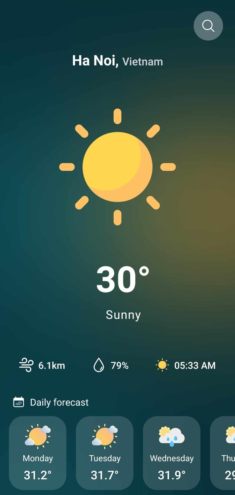
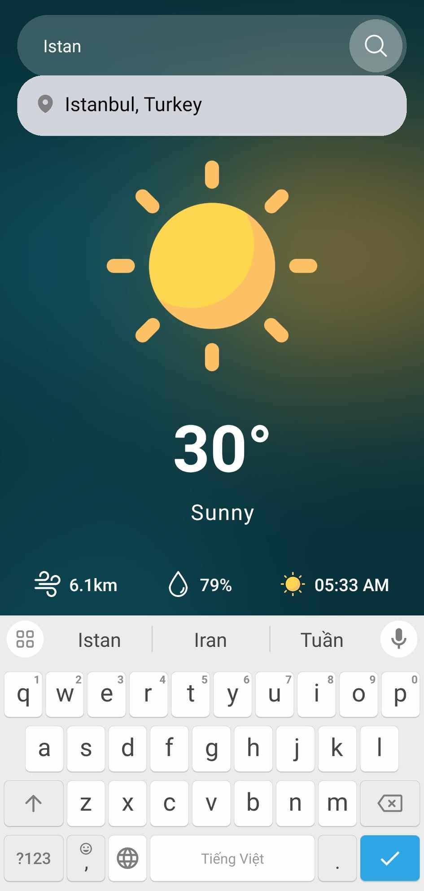

# Weather App

This is a React Native weather app that allows users to get up-to-date weather information for different locations. The app is built using React Native and styled with Tailwind CSS.

# UI


## Features

- Current weather information for a given location
- Hourly and daily weather forecasts
- Search functionality to find weather information for specific locations
- User-friendly interface with intuitive design


## Installation

To install and run the app locally, follow these steps:

1. Clone the repository:

```bash
git clone <repository-url>
```
2. Navigate to the project directory:

```bash
cd react-native-tailwind
```
3. Install the dependencies:

```bash
npm install
```
4. Start the development server:

```bash
npm run start
```

5. Use a mobile device or emulator to run the app.
   
# Configuration
The app requires an API key from a weather data provider to fetch weather information. Follow these steps to set up the API key:

Sign up for an account with a weather data provider (e.g., OpenWeatherMap, Weatherbit, etc.).

**API**

- [https://www.weatherapi.com/](https://www.weatherapi.com/)

To use the app effectively, consider the following:

- Grant the app permission to access your device's location for accurate weather data.

- Ensure a stable internet connection to fetch weather information.

- Explore the various screens and features available, such as hourly and daily forecasts
  
# Contributing
Contributions to the Weather App project are welcome and encouraged. If you find any issues or have suggestions for improvements, please submit an issue or a pull request to the GitHub repository.

# Acknowledgements

- [React Native](https://reactnative.dev/)
- [Tailwind CSS](https://tailwindcss.com/)
- [Weather API](https://www.weatherapi.com/)
